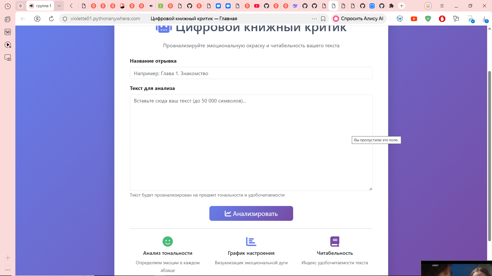
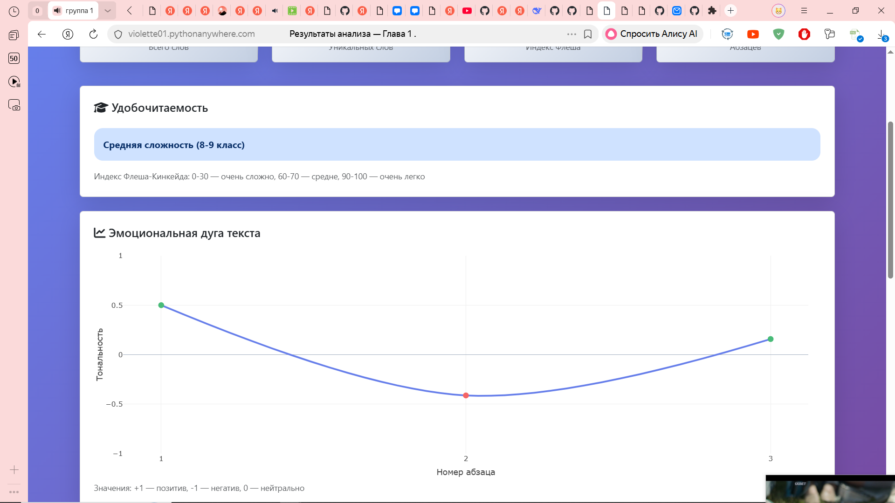
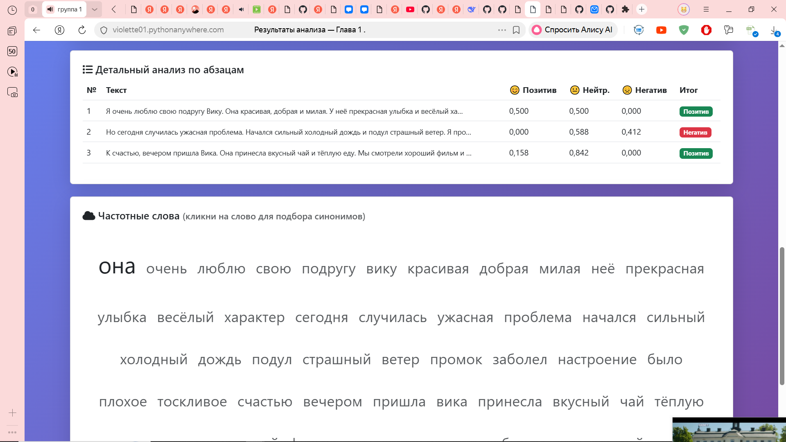
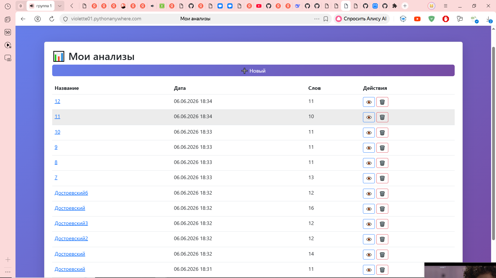
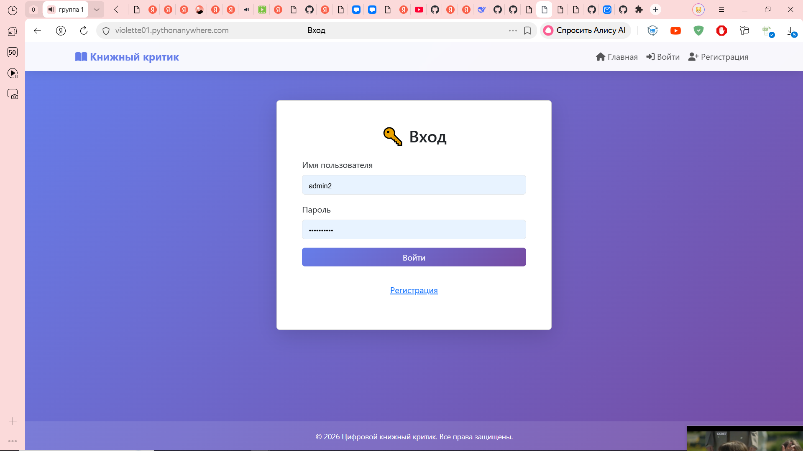
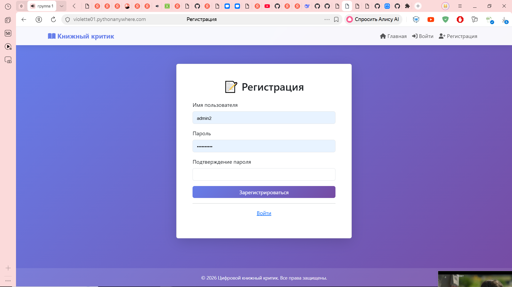

# Цифровой книжный критик

Сервис для анализа тональности и читабельности текстов.

## Ссылка
https://violette01.pythonanywhere.com

## Технологии
Python 3.13, Django 4.2, Plotly, Bootstrap 5, pymorphy2

## Установка
1. git clone https://github.com/mil250431-ops/project.git
2. python -m venv venv && source venv/bin/activate
3. pip install -r requirements.txt
4. python manage.py migrate
5. python manage.py runserver
## Скриншоты

### Главная страница

### Результаты анализа

### Облако слов и синонимы

### Личный кабинет (Мои анализы)

### Вход

### Регистрация

